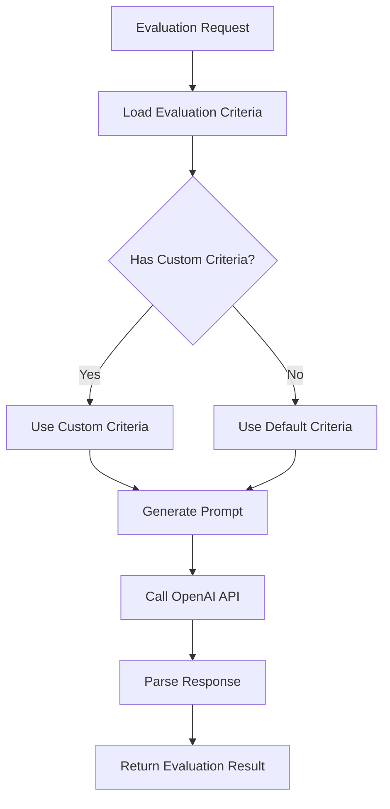

# Evaluation Service

## Overview

The Nucleus Evaluation Service is the core component responsible for automatically evaluating AI model outputs using LLM-based assessment. It provides a flexible, configurable system for quality assurance in AI-enabled automation workflows.

## Architecture

### Core Components

1. **EvaluationService** - Main service orchestrating the evaluation process
2. **EvaluationCriteria** - Configurable evaluation templates with versioning
3. **OpenAI Integration** - LLM-based evaluation using Semantic Kernel
4. **Prompt Management** - Dynamic prompt generation based on criteria

### Service Flow

## EvaluationCriteria System

### Purpose

The EvaluationCriteria system addresses the limitation of hardcoded evaluation criteria by providing:

- **Versioned Templates**: Track changes and improvements over time
- **Task-Specific Criteria**: Different evaluation standards for different AI tasks
- **Customizable Factors**: Adjust what aspects are evaluated
- **Library Management**: Build a collection of proven evaluation templates

### Key Concepts

**Criteria Definition**: Each evaluation criteria template defines:
- **Scale**: The scoring range (e.g., 1-5) and what each level means
- **Factors**: What aspects to evaluate (accuracy, completeness, relevance, quality)
- **Thresholds**: What constitutes a "passing" score
- **Description**: Human-readable explanation of the evaluation approach

**Versioning**: Criteria templates are versioned to:
- Track improvements over time
- Enable A/B testing of different approaches
- Allow rollback to previous versions if needed
- Maintain audit trail of evaluation standards

**Task-Specific Standards**: Different AI tasks require different evaluation approaches:
- **Summarization**: Focus on accuracy, completeness, and conciseness
- **Classification**: Emphasize precision, recall, and confidence
- **Generation**: Prioritize creativity, relevance, and coherence
- **Translation**: Stress accuracy, fluency, and cultural appropriateness

## Benefits of Configurable Criteria

### 1. **Task-Specific Evaluation**

Different AI tasks require fundamentally different evaluation standards. A one-size-fits-all approach misses the nuances that make each task unique:

- **Summarization**: How well does the output capture key points while being concise?
- **Classification**: How accurate is the categorization and how confident is the model?
- **Generation**: How creative and relevant is the generated content?
- **Translation**: How accurate and culturally appropriate is the translation?

### 2. **Continuous Improvement**

The versioned approach enables systematic improvement:

- **Version Control**: Track criteria changes and their impact on evaluation quality
- **A/B Testing**: Compare different evaluation approaches on the same data
- **Performance Tuning**: Optimize criteria based on human feedback and real-world results
- **Domain Adaptation**: Customize for specific industries or use cases

### 3. **Library Management**

Build a collection of proven evaluation templates that can be shared and reused:

- **Best Practices**: Document what works well for different scenarios
- **Knowledge Sharing**: Teams can learn from each other's evaluation approaches
- **Consistency**: Maintain consistent standards across multiple workflows
- **Innovation**: Experiment with new evaluation techniques

## Client Experience

### API Integration

**Request Enhancement**: The evaluation API accepts optional criteria parameters:
- **criteriaId**: Use a specific version of criteria from the library
- **customCriteria**: Provide inline custom criteria for one-off evaluations
- **Fallback**: If no criteria specified, use the default for the task type

**Response Enrichment**: Evaluation responses include:
- **Score**: The numerical evaluation result
- **Pass/Fail**: Whether the output meets quality standards
- **Feedback**: Human-readable explanation of the evaluation
- **Criteria Used**: Metadata about which criteria template was applied
- **Factor Scores**: Optional detailed scoring across different dimensions

### Usage Patterns

**1. Default Evaluation**: Use standard criteria for common tasks
- Simplest integration - just specify the task type
- Good for getting started quickly
- Uses proven, well-tested evaluation standards

**2. Specific Criteria**: Use a particular version of criteria
- When you need consistent evaluation standards
- For compliance or audit requirements
- When you want to use a proven template

**3. Custom Criteria**: Define specialized evaluation standards
- For domain-specific requirements
- When standard criteria don't fit your use case
- For experimental or research purposes

## Evaluation Workflow

### 1. **Criteria Selection**
The system determines which evaluation criteria to use:
- If a specific criteria ID is provided, use that template
- If custom criteria are provided inline, use those
- Otherwise, use the default criteria for the task type

### 2. **Prompt Generation**
The service dynamically generates evaluation prompts based on the selected criteria:
- Incorporates the specific factors to evaluate
- Uses the defined scoring scale and descriptions
- Includes the appropriate pass threshold

### 3. **LLM Evaluation**
The generated prompt is sent to the LLM evaluator:
- Provides context about the task and input/output data
- Gives clear instructions on how to evaluate
- Requests structured response format

### 4. **Result Processing**
The LLM response is parsed and validated:
- Extracts the numerical score and feedback
- Validates the score is within the expected range
- Determines pass/fail status based on threshold

## Future Enhancements

### 1. **Multi-Factor Scoring**
Support for detailed scoring across multiple dimensions with configurable weights, enabling more nuanced evaluation of complex outputs.

### 2. **Adaptive Thresholds**
Dynamic pass thresholds that adjust based on task complexity, domain requirements, or historical performance data.

### 3. **Human Feedback Integration**
Use human feedback to continuously improve evaluation criteria over time, creating a learning system that gets better with use.

### 4. **Criteria Marketplace**
A library of pre-built evaluation criteria for common tasks and domains, allowing teams to leverage proven evaluation standards.

## Conclusion

The configurable EvaluationCriteria system transforms Nucleus from a simple evaluation service into a sophisticated, adaptable quality assurance platform. By enabling versioned, task-specific, and customizable evaluation criteria, organizations can:

- **Improve Accuracy**: Fine-tune evaluation standards for specific use cases
- **Enable Innovation**: Experiment with new evaluation approaches
- **Scale Quality**: Maintain consistent standards across multiple workflows
- **Drive Improvement**: Use data-driven insights to enhance AI performance

This system positions Nucleus as a comprehensive solution for AI quality management in automation workflows, providing the flexibility and sophistication needed for enterprise-scale AI operations. 